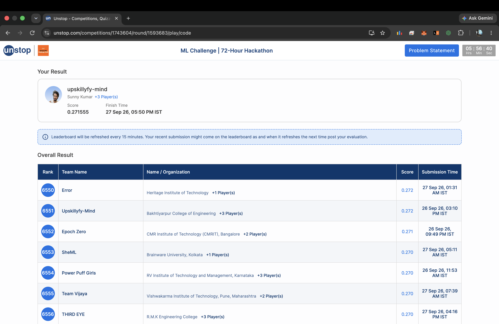

<p align="center">


</p>
----

## 📄 License

This project is licensed under the **MIT License**.

See the [LICENSE](LICENSE) file for details.

# 🧠 Amazon ML Challenge 2026 — Business Entity Resolution 📈 

<p align="center">
  
</p>

##  Overview 📈
 
This project was developed for the **Amazon ML Challenge 2026**, focused on **Business Entity Resolution**.

The goal was to identify records belonging to the same real-world business across multiple data sources despite differences in:

- Business names
- Addresses
- Abbreviations
- Legal suffixes
- Punctuation
- Typos
- Transliteration
- Missing or reordered address components

The project explores a large-scale entity resolution pipeline combining **data normalization, blocking, candidate generation, similarity features, validation, and precision-focused matching**.

---

## 🎯 Problem Statement

Given business records from multiple sources, the task is to determine which records refer to the same real-world business.

A simplified example:

```text
Source 1:
ABC Restaurant
12 MG Road, Bengaluru

Source 2:
ABC Rest.
12 M.G. Rd, Bangalore

Source 3:
A.B.C Restaurant
12 MG Road Bengaluru
```

Although the records are written differently, they may represent the same business. The system attempts to identify these relationships while avoiding incorrect matches.

---

## 🧠 Solution Approach

The project follows a multi-stage entity resolution pipeline:

```
Raw Business Data
        │
        ▼
Data Loading & Normalization
        │
        ▼
Candidate Generation / Blocking
        │
        ▼
Name & Address Similarity
        │
        ▼
Feature Engineering
        │
        ▼
Matching / Decision Rules
        │
        ▼
Candidate Validation
        │
        ▼
Final Matching Results
```

### 1. Data Processing
The project processes large TSV datasets containing business entities from multiple sources. SQLite was used during experimentation to support large-scale indexing and candidate generation.

### 2. Text Normalization
Business names and addresses were normalized to reduce differences caused by:
- Case variations
- Punctuation
- Abbreviations
- Formatting differences
- Address variations

### 3. Candidate Generation
Blocking was used to avoid comparing every business against every other business. Candidate generation explored signals such as:
- Normalized business names
- Address information
- Name tokens
- Address tokens
- Exact matches
- Rare tokens
- Numeric/address information

### 4. Feature Engineering
The project experimented with multiple similarity features, including:
- Name similarity
- Name token-sort similarity
- Name token-set similarity
- Name Jaccard similarity
- Name containment
- Address similarity
- Address token similarity
- Address Jaccard similarity
- Address containment
- Numeric overlap
- Name length difference
- Address length difference
- Exact name matching
- Exact address matching
- Name prefix matching
- Address number overlap

### 5. Matching
The final competition submission used a precision-focused rule-based matching pipeline. ML-based pair scoring and additional training experiments were also explored during development.

---

## 🏗️ Project Structure

```
amazon-ml-challenge-2026/
│
├── assets/
│   ├── dashboard.png
│   └── leaderboard.png
│
├── code/
│   └── business_entity_resolution/
│       ├── src/
│       │   ├── blocking.py
│       │   ├── blocking_diagnostic.py
│       │   ├── blocking_validation.py
│       │   ├── config.py
│       │   ├── data.py
│       │   ├── fast_infer.py
│       │   ├── fast_val.py
│       │   ├── features.py
│       │   ├── finalize_matches.py
│       │   ├── infer.py
│       │   ├── metrics.py
│       │   ├── model.py
│       │   ├── text_utils.py
│       │   ├── train.py
│       │   ├── train_fast.py
│       │   ├── train_fast2.py
│       │   ├── train_quick.py
│       │   ├── train_sampled.py
│       │   └── ultra_val.py
│       │
│       └── src_backup/
│
├── dataset/
│   ├── train/
│   ├── train_small/
│   ├── small_run/
│   └── test/
│
├── output/
│   ├── candidate_pairs.tsv
│   └── matching_results.tsv
│
├── utils/
│   └── validate_submission.py
│
├── Documentation_template.md
├── filter_script.py
├── precision_booster.py
├── run.sh
├── smoke_test.py
├── smoke_test_output.txt
└── team_submission.zip
```

---

## 📊 Challenge Dashboard

<p align="center">
  
</p>

---

## 🏆 Leaderboard Result

**Final Submission**

| Metric | Result |
|---|---|
| Challenge | Amazon ML Challenge 2026 |
| Score | 0.271555 |
| Rank | 6551 |
| Approx. Participants | 30,000+ |
| Approx. Percentile Position | Top ~22% |

The result provided valuable experience in designing and evaluating large-scale entity resolution systems.

### 🏅 Leaderboard Screenshot

<p align="center">
  
</p>

---

## 📈 Evaluation Metric

The challenge used **Macro F0.5**, which places greater emphasis on precision than recall.

The general Fβ score is:

```
          (1 + β²) × Precision × Recall
Fβ  =     ------------------------------
          (β² × Precision) + Recall
```

For this challenge, **β = 0.5**, so:

```
          1.25 × Precision × Recall
F0.5  =   --------------------------
          0.25 × Precision + Recall
```

This makes incorrect entity matches particularly costly to control, while still requiring sufficient recall.

---

## 🔍 Key Challenges

**High-Scale Data**
The datasets contained millions of business records, making brute-force pairwise comparison impractical.

**Entity Variations**
The same business could appear with significant differences in:
- Name
- Address
- Abbreviations
- Typos
- Punctuation
- Transliteration
- Formatting

**Candidate Generation**
Candidate generation was one of the most challenging parts of the project. If a true matching record is not included in the candidate set, the downstream matching stage cannot recover it.

**Precision vs Recall**
The competition's precision-focused metric required careful control of false matches while avoiding excessive empty predictions.

---

## 🧪 Experiments

Several approaches were explored during development:

- Rule-based matching
- SQLite-based blocking
- Multi-signal candidate generation
- Fuzzy name similarity
- Address similarity
- Token-based similarity
- Jaccard similarity
- Containment features
- Numeric overlap
- ML-based pair scoring
- Threshold experimentation
- Candidate validation
- Sampled training experiments

The final submitted pipeline was based on the working rule-based approach, after the full-scale ML training experiments did not successfully integrate into the final submission.

---

## 📚 Key Learnings

This challenge provided practical experience with:

- Large-scale data processing
- Entity resolution
- Record linkage
- Blocking strategies
- Candidate generation
- Feature engineering
- Fuzzy string matching
- SQLite indexing
- Precision/recall trade-offs
- F0.5 optimization
- Large dataset handling
- Submission validation
- Git LFS
- Reproducible ML experimentation

### Most Important Learning

A strong entity resolution system needs both:

```
High-Recall Candidate Generation
              +
High-Precision Matching
```

A sophisticated matcher cannot recover a true match that was removed during candidate generation.

---

## 🛠️ Tech Stack

- Python
- Pandas
- NumPy
- SQLite
- Fuzzy String Matching
- Machine Learning
- Git / GitHub
- Git LFS

---

## 📦 Submission Files

The repository contains the main competition outputs:

- `output/matching_results.tsv`
- `output/candidate_pairs.tsv`

The final submission package is also included:

- `team_submission.zip`

Large datasets and intermediate databases are managed separately from the normal Git history where required.

---

## 👨‍💻 Author

**Sunny Kumar**
B.Tech — Computer Science & Engineering

Interested in:
- Machine Learning
- Artificial Intelligence
- Competitive Programming
- Full-Stack Development
- Data & Entity Resolution
- Open Source

---

## ⭐ Acknowledgement

This project was developed as part of the Amazon ML Challenge 2026. The challenge provided an opportunity to work on a real-world style entity resolution problem involving noisy business data, large-scale candidate generation, and precision-focused evaluation.

---

## 📌 Project Status

**Completed** — Amazon ML Challenge 2026 Submission
**Score:** 0.271555
**Rank:** 6551 / ~30,000+ participants
